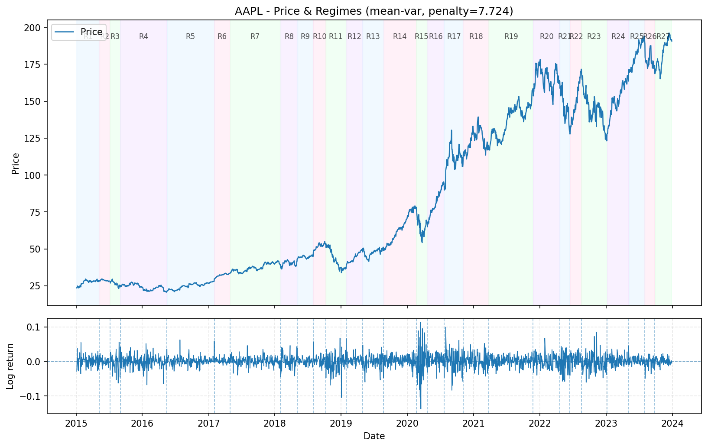

# regime-radar

A Python CLI tool for detecting structural regime shifts in financial time series using penalized Gaussian segmentation.  
`regime-radar` ingests historical price data for any ticker, computes log-returns, and identifies statistically significant breakpoints where the joint behavior of the mean and variance changes.

The default model is a **piecewise-Gaussian with regime-specific mean and variance**, solved exactly via dynamic programming under a penalized negative log-likelihood objective.

## Features

- Fetch daily historical prices for any ticker (via `yfinance`)
- Compute log returns:  
  $$ r_t = \log P_t - \log P_{t-1} $$
- Detect statistically significant regime shifts using:
  - **Mean-shift model** (`--model mean`)
  - **Mean + variance model** (`--model mean-var`, default)

- Penalized segmentation with:
  - BIC penalty (`--penalty bic`)
  - AIC penalty (`--penalty aic`)
  - Custom scalar penalty (`--penalty &lt;float&gt;`)

- Produce a structured JSON report of regimes (start, end, mean, volatility, annualized stats)
- Generate a publication-quality PNG plot:
  - Price series with shaded regimes
  - Returns panel with vertical boundary markers

## Installation

This project uses `uv`. Clone the repo and let `uv` handle the environment:

```bash
git clone https://github.com/&lt;your-username&gt;/regime-radar.git
cd regime-radar
uv sync
```

Now you can run the CLI using:

```bash
uv run python -m regime_radar.cli --help
```

## Quick Start

Example command used to generate the example JSON + plot included in the repo:

```bash
uv run python -m regime_radar.cli AAPL \
  --start 2015-01-01 \
  --end 2024-01-01 \
  --penalty bic \
  --min-seg-len 40 \
  --model mean-var \
  --json-out reports/aapl_regimes.json \
  --plot-out plots/aapl_regimes.png
```

This performs:

1. Downloads AAPL price data from 2015 → 2024  
2. Converts to log returns  
3. Runs the Gaussian **mean + variance** regime detector with:  
   - BIC penalty ($\lambda = \log n$)  
   - minimum segment length = 40 trading days  
4. Writes a JSON report  
5. Writes a PNG plot

## Example Plot (PNG)

This is the output saved at `plots/aapl_regimes.png`:




The top panel shows:

- AAPL price series  
- Alternating shaded regions = detected regimes  
- Regime labels (R1, R2, …)

The bottom panel shows:

- Daily log returns  
- Vertical dashed lines marking regime boundaries

## Example JSON Report

This is the corresponding JSON report written to `reports/aapl_regimes.json`:

```
{
  "ticker": "AAPL",
  "start_date": "2015-01-05",
  "end_date": "2023-12-29",
  "n_observations": 2263,
  "penalty": 7.724446645633537,
  "total_cost": -18740.608280456152,
  "regimes": [
    {
      "index": 1,
      "start_date": "2015-01-05",
      "end_date": "2015-05-08",
      "length": 87,
      "mean_daily": 0.0018711916252853733,
      "vol_daily": 0.016319809188455426,
      "mean_annual": 0.4715402895719141,
      "vol_annual": 0.2590689393400794
    },
    {
      "index": 2,
      "start_date": "2015-05-11",
      "end_date": "2015-07-07",
      "length": 40,
      "mean_daily": -0.00038096267263594276,
      "vol_daily": 0.009008403645049526,
      "mean_annual": -0.09600259350425758,
      "vol_annual": 0.14300397452693292
    },
    ...
    {
      "index": 27,
      "start_date": "2023-09-28",
      "end_date": "2023-12-29",
      "length": 65,
      "mean_daily": 0.0018960606637490193,
      "vol_daily": 0.009652296631496438,
      "mean_annual": 0.47780728726475286,
      "vol_annual": 0.1532254588053962
    }
  ]
}
```

Fields include:

- `ticker`
- `start_date`, `end_date`
- `n_observations`
- `penalty`
- `total_cost`
- `regimes`: list of segments with:
  - start/end dates  
  - segment length  
  - daily mean / volatility  
  - annualized mean / volatility

## Mathematical Model (Summary)

Let $r_0, \dots, r_{n-1}$ be log returns. We look for a segmentation

$$
\{ 0 = \tau_0 < \tau_1 < \dots < \tau_{K-1} < \tau_K = n \},
$$

such that for each regime $k$:

$$
r_t \sim \mathcal{N}(\mu_k, \sigma_k^2), \quad \tau_{k-1} \le t < \tau_k,
$$

For a segment $[s,t)$ with $m = t-s$ and SSE

$$
\text{SSE}(s,t) =
\sum_{i=s}^{t-1}(r_i - \bar{r}_{s:t})^2,
$$

the negative log-likelihood (up to constants) is:

$$
C_{\text{mean-var}}(s,t)
= m \log\!\left(\frac{\text{SSE}(s,t)}{m}\right).
$$

The total penalized cost for a segmentation is:

$$
\text{TotalCost}
= \sum_{k=1}^K \left[ C(\tau_{k-1}, \tau_k) + \lambda \right].
$$

We solve exactly via dynamic programming:

$$
F(t)
= \min_{0 \le s \le t - m_{\min}}
\{ F(s) + C(s,t) + \lambda \},
\quad F(0)=0.
$$

Breakpoints are recovered by backtracking.  
Full derivation is provided in [`docs/math.md`](docs/math.md).

## CLI Usage

```bash
uv run python -m regime_radar.cli [ticker]; [options]
```

Options:

- `--start YYYY-MM-DD`
- `--end YYYY-MM-DD`
- `--field {adj_close, close}`
- `--model {mean, mean-var}`
- `--penalty {bic, aic, float}`
- `--min-seg-len N`
- `--json-out path`
- `--plot-out path`

## Example: Model Comparison

Mean-shift only:

```bash
uv run python -m regime_radar.cli AAPL --model mean --penalty bic
```

Often detects **1 regime** for multi-year daily data (mean barely shifts).

Mean + variance (recommended):

```bash
uv run python -m regime_radar.cli AAPL --model mean-var --penalty bic
```

Captures real volatility regimes (crises, low-volatility periods, etc.).

## Repository Structure

```
regime-radar/
  pyproject.toml
  README.md
  docs/
    math.md
  regime_radar/
    cli.py
    data.py
    model.py
    plotting.py
    report.py
  plots/
    aapl_regimes.png      # (example, provided separately)
  reports/
    aapl_regimes.json     # (example, provided separately)
```
